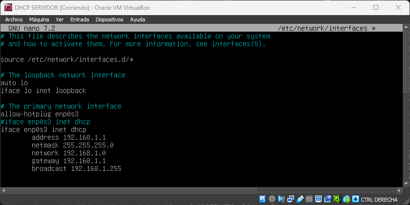

# DHCP-configure-ha
<div align="center">
  
</div>

Configuración de servidor DHCP con failover y relay para alta disponibilidad. En este repositorio, encontrarás scripts y configuraciones para establecer un entorno de DHCP con redundancia y failover, que incluye la configuración de un relay DHCP para encaminar solicitudes DHCP entre subredes. Asegura la disponibilidad del servicio DHCP en tu red.

## 1.STACK 

- 4 MAQUINAS VIRTUALES (debian12)
  - 1 Servidor DHCP Primario
  - 1 Servidor DHCP Secundario (Failover)
  - 1 Router con DHCP Relay
  - 1 Cliente

- Virtualbox 7.0 (con extension pack)  

**_NOTA_**: modo promiscuo en las interfaces de red siempre activado
## 2.TOPOLOGÍA

DHCPSERVER -> RELAY -> CLIENTE

DHCPERVER RESPALDO


## 3.CONFIGURACIÓN DHCP SERVER PRIMARIO

Con el adaptador de red en modo puente para descargar el isc-dhcp-server

```bash
sudo apt update
sudo apt install isc-dhcp-server -y
```


**_NOTA_**: al comprobar el estado del servicio veras que esta failed , no te preocupes es normal pues no esta configurado. Si utilizamos `journalctl -xe` o `journalctl -u isc-dhcp-server` podremos ver el error.


Ahora cambiamos el adaptador de red a red interna y configuramos el archivo `/etc/network/interfaces`

`ip a` para ver nuestras interfaces de red




En mi caso , voy a asignarle a mi servidor la ip 192.168.1.1
Aplicamos los cambios(ctrl O + ctrl X) y reiniciamos el servicio
```bash
systemctl restart networking.service
ip a #para comprobar que se ha asignado la ip
ip r #para comprobar la tabla de rutas
```
## 3.1 ARCHIVOS DE CONFIGURACION DEL SERVIDOR PRIMARIO

- `/etc/default/isc-dhcp-server` : aquí añadiremos nuestra interfaz “enp0s3” en INTERFACESv4.


- `/etc/dhcp/dhcpd.conf` : aqui añadiremos en el apartado para una red interna, la red, la mascara y el rango que va a proporcionar de ips.


---
En mi caso , subnet 192.168.1.0 netmask 255.255.255.0 { range 192.168.1.10 192.168.1.50;
option routers 192.168.1.1;
}

**_NOTA_**: es opcional pero se recomienda añadir el option routers, nos servirá posteriormente para el relay.

