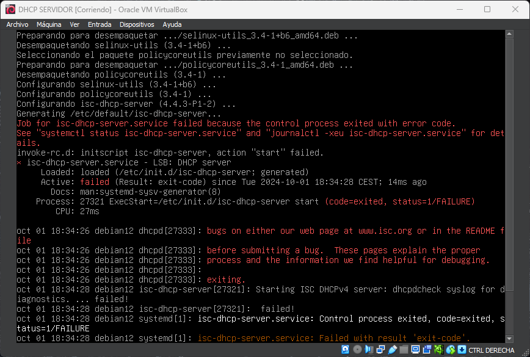

# DHCP-configure-ha
<div align="center">
  
</div>

Configuración de servidor DHCP con failover y relay para alta disponibilidad. En este repositorio, encontrarás scripts y configuraciones para establecer un entorno de DHCP con redundancia y failover, que incluye la configuración de un relay DHCP para encaminar solicitudes DHCP entre subredes. Asegura la disponibilidad del servicio DHCP en tu red.

## STACK 

- 4 MAQUINAS VIRTUALES (debian12)
  - 1 Servidor DHCP Primario
  - 1 Servidor DHCP Secundario (Failover)
  - 1 Router con DHCP Relay
  - 1 Cliente

- Virtualbox 7.0 (con extension pack)  

**_NOTA_**: modo promiscuo en las interfaces de red siempre activado
## TOPOLOGÍA

DHCPSERVER -> RELAY -> CLIENTE

DHCPERVER RESPALDO


## CONFIGURACIÓN DHCP SERVER PRIMARIO

con el adaptador de red en modo puente para descargar el isc-dhcp-server

```bash
sudo apt update
sudo apt install isc-dhcp-server -y
```




