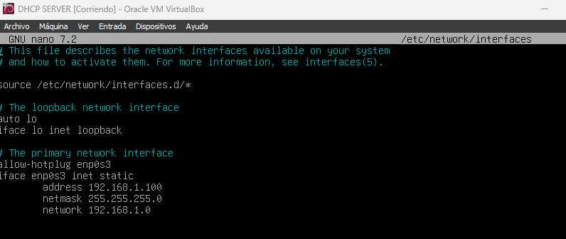
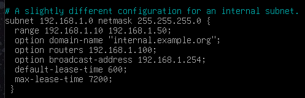
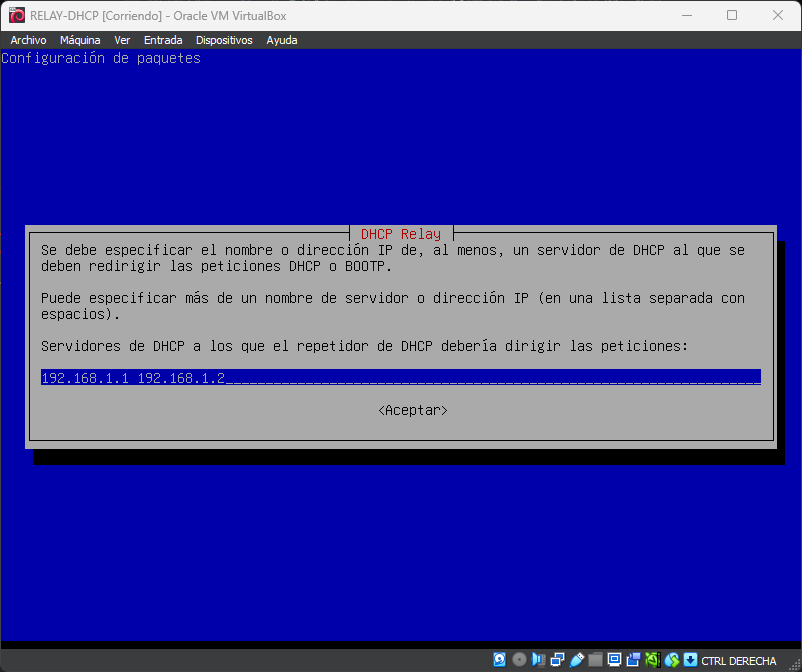
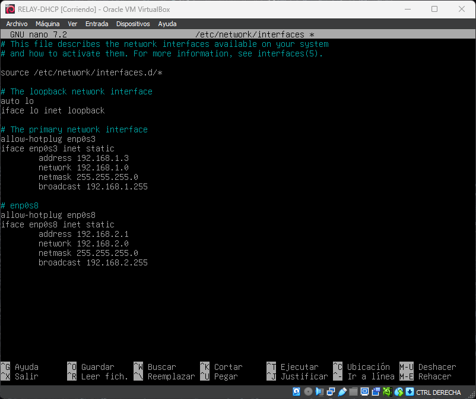

# DHCP-configure-ha
<div align="center">
  
</div>

Configuración de servidor DHCP con failover y relay para alta disponibilidad. En este repositorio, encontrarás scripts y configuraciones para establecer un entorno de DHCP con redundancia y failover, que incluye la configuración de un relay DHCP para encaminar solicitudes DHCP entre subredes. Asegura la disponibilidad del servicio DHCP en tu red.

## 1. STACK 

- 4 MAQUINAS VIRTUALES (debian12)
  - 1 Servidor DHCP Primario
  - 1 Servidor DHCP Secundario (Failover)
  - 1 Router con DHCP Relay
  - 1 Cliente

- Virtualbox 7.0 (con extension pack)  

**_NOTA_**: modo promiscuo en las interfaces de red siempre activado
## 2. TOPOLOGÍA Y CONCEPTOS


DHCPSERVER PRIMARIO -> DHCPSERVER SECUNDARIO (RESPALDO FAILOVER)

DHCPSERVER PRIMARIO -> ROUTER (RELAY) (para encaminar solicitudes DHCP entre subredes)

DHCP CLIENT -> DHCPSERVER PRIMARIO (para obtener una dirección IP)


## 3. CONFIGURACIÓN DHCP SERVER PRIMARIO

Con el adaptador de red en modo puente para descargar el isc-dhcp-server

```bash
sudo apt update
sudo apt install isc-dhcp-server -y
```


**_NOTA_**: al comprobar el estado del servicio veras que esta failed , no te preocupes es normal pues no esta configurado. Si utilizamos `journalctl -xe` o `journalctl -u isc-dhcp-server` podremos ver el error.


Ahora cambiamos el adaptador de red a red interna y configuramos el archivo `/etc/network/interfaces`

`ip a` para ver nuestras interfaces de red




En mi caso , voy a asignarle a mi servidor la ip 192.168.1.1
Aplicamos los cambios(ctrl O + ctrl X) y reiniciamos el servicio
```bash
systemctl restart networking.service
ip a #para comprobar que se ha asignado la ip
ip r #para comprobar la tabla de rutas
```
## 3.1 ARCHIVOS DE CONFIGURACION DEL SERVIDOR PRIMARIO

- `/etc/default/isc-dhcp-server` : aquí añadiremos nuestra interfaz “enp0s3” en INTERFACESv4.


- `/etc/dhcp/dhcpd.conf` : aqui añadiremos en el apartado para una red interna, la red, la mascara y el rango que va a proporcionar de ips.


---
En mi caso , subnet 192.168.1.0 netmask 255.255.255.0 { range 192.168.1.10 192.168.1.50;
option routers 192.168.1.1;
}

**_NOTA_**: es opcional pero se recomienda añadir el option routers, nos servirá posteriormente para el relay.

Por último, reiniciamos el servicio y comprobamos que no haya errores y ya quedaria levantado el servidor primario.


```bash
systemctl restart isc-dhcp-server
systemctl status isc-dhcp-server
```

**_NOTA_**: `/var/lib/dhcp/dhcpd.leases` : archivo donde se guardan las ips asignadas a los clientes.De momento estará vacío.

## 4. CONFIGURACIÓN DHCP CLIENT

En la maquina cliente, cambiamos el adaptador de red a red interna y vamos a usar dos comandos para obtener una ip. Recordar que puede ser que necesitemos ejecutar el comando como superusuario.
```bash
dhclient -r
dhclient -v
```


aqui podemos ver como el cliente ha obtenido la ip de nuestro servidor dhcp.Le asigna la ip tras una petición de la ip. El servidor recibe una request , hace una offer y el cliente la acepta.

con `ip a` podemos ver la ip asignada al cliente.
en mi caso nos ha dado una del rango confiuurado en el servidor.

Si vamos al archivo `/var/lib/dhcp/dhcpd.leases` veremos que se ha añadido una entrada con la ip asignada al cliente.


## 5. CONFIGURACIÓN DHCP RELAY

 ### 5.1 instalación y configuración del relay
Antes de nada, vamos a instalar el paquete isc-dhcp-relay en nuestra maquina saliendo a internet con adaptador puente.

```bash
sudo apt update
sudo apt install isc-dhcp-relay -y
```

Aqui le asignamos la ip del servidor dhcp primario.(en nuestro caso 192.168.1.100)


Aqui le ponemos la interfaz por la que va a escuchar las peticiones dhcp.(en nuestro caso enp0s3)


En la tercera opcion no añadiremos nada

**_NOTA_**: el fichero donde configuramos el relay es `/etc/default/isc-dhcp-relay` por si después queremos modificar algo.
---
Tenemos una máquina virtual con dos adaptadores de red interna, red 1  para el servidor dhcp y red 2 para el cliente.Todo esto tenemos que hacerlo en virtualbox en los ajustes de la configuración de la máquina.


 `ip a` par ver las interfaces de red -> tenemos enp0s3 y enp0s8


(tenemos ip porque el dhcp server esta funcionando y la interfaz enp0s3 esta en en la misma red que el servidor)

enp0s3 -> red interna con el servidor dhcp

enp0s8 -> red interna con el cliente

¡¡¡¡¡¡¡¡¡NO OLVIDAR!!!!!!!

 ### 5.2 configuración de las interfaces de red

Configuramos el archivo `/etc/network/interfaces` para asignarle una ip a la interfaz enp0s3 y a la interfaz enp0s8.
```bash
nano /etc/network/interfaces
```


guardamos los cambios y reiniciamos el servicio de red
```bash
systemctl restart networking.service
```

### 5.3 habilitar el forwarding para el reenvio de paquetes entre interfaces de red
Modificación en /proc/sys/net/ipv4/ip_forward para habilitar el forwarding de paquetes entre interfaces de red.
```bash
echo 1 > /proc/sys/net/ipv4/ip_forward
```


---

Modificación en /etc/sysctl.conf para habilitar el forwarding de paquetes entre interfaces de red.
```bash
nano /etc/sysctl.conf
```


descomentar la linea `net.ipv4.ip_forward=1`

### 5.4 Configuración de las rutas estáticas

